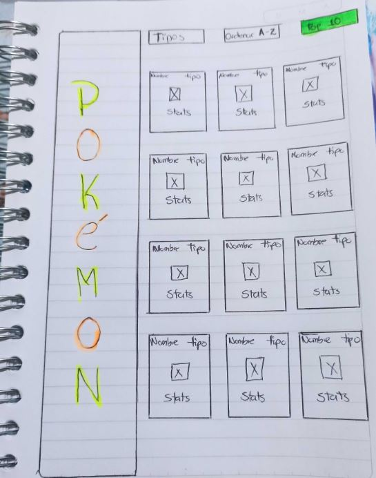
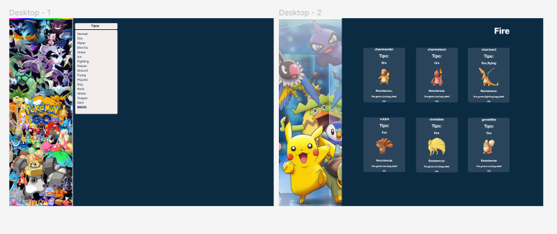
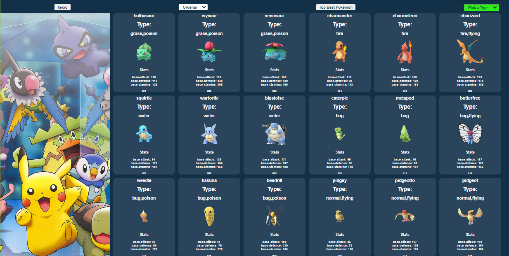
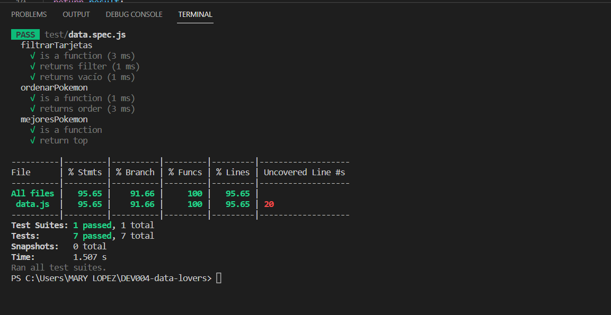
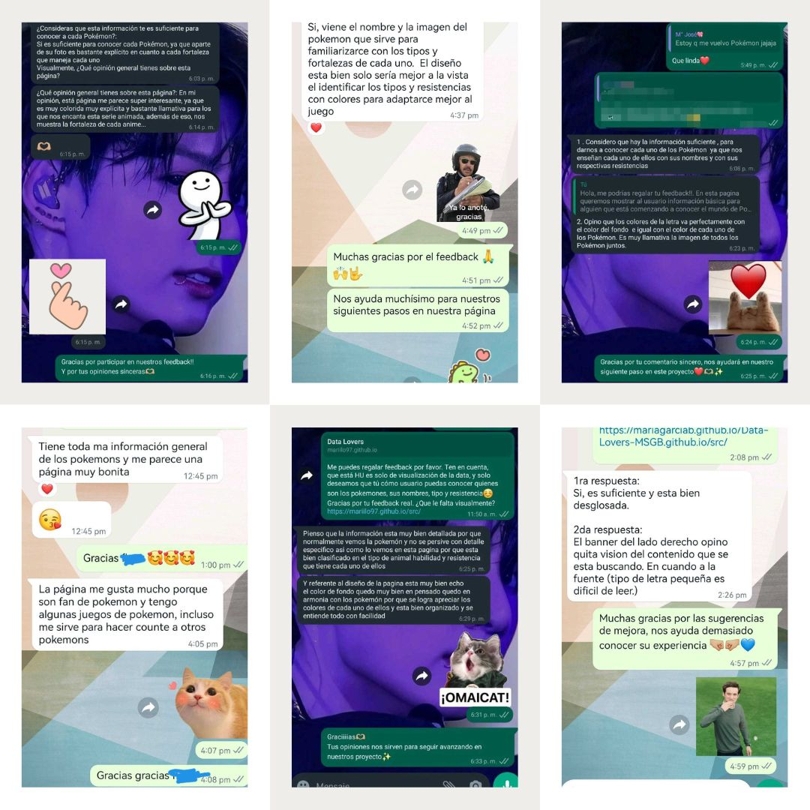
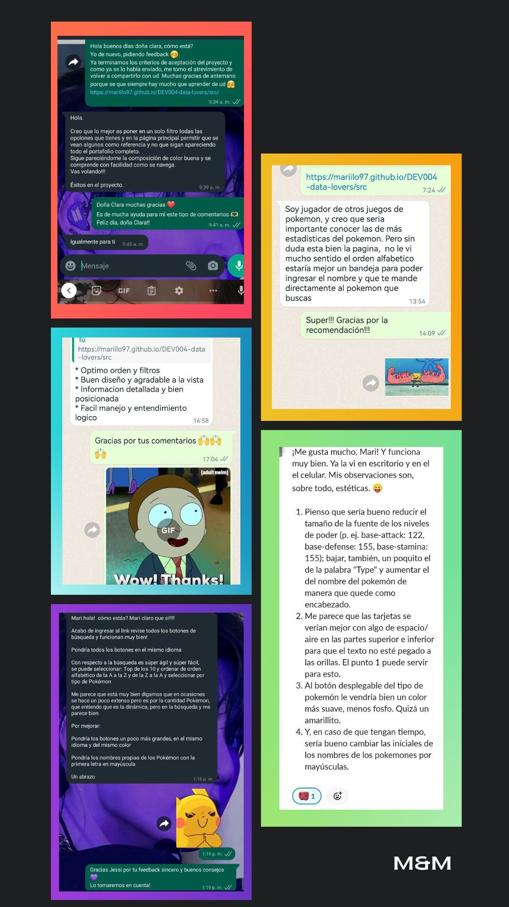

# Data Lovers M&M

## 1. Preámbulo

Este proyecto esta diseñado para personas con conocimiento básico de Pokémon y nociones de pokemon Go. La página tienen como finalidad presentar de manera organizada la informacion de cada pokémon como un respaldo al momento de tomar decisiones en el juego. Por lo cual está organizada por número de tarjeta, donde la misma secuencia muestra a los Pokémones en orden de evolución; además las funciones establecida en la página son:
- El flitro de Pokémones por tipo
- La opción de organizar alfabéticamente
- Un top de pokémones con el mejor promedio según sus estadísticas

## 2. Proceso de Proyecto 

La organización y estructura del proyecto se determina por medio de un Trello https://trello.com/b/osTHmbGw/readme

Cómo primer objetivo se espicifican  la población a quien  va dirigida la página, posteriormente se realizan las historias de usuarios con criterios de aceptación y término; con las siguientes funcionalidades :
-Ordenar
-Filtrar 
-Calcular
Teniendo en cuenta su realización de manera responsive.
Basándonos en nuestros usuarios creamos un prototipo de baja fidelidad.

Nuestro prototipo de baja fidelidad ya definido.

  

 
Teníamos como prioridad, darle la posibilidad a nuestro usuario de visualizar las tarjetas de los Pokémons, en estas darles información especifica como: 

* Nombre de Pokémon

* Tipo de Pokémon 

* Estadísticas: tomando tres de estas
   * base-attack
   * base-defense
   * base-stamina 

* Numero de Pokémon. 

Esto con la finalidad de que nuestro usuario tuviera suficiente información a primera vista para poder conocer lo suficiente de cada Pokémon y así reconocerlos.
Ya teniendo esto en cuenta creamos nuestro prototipo de alta fidelidad de nuestra primera historia de usuario.

Concluyendo este proceso, comenzamos con nuestra segunda historia de usuario. Esta estaba dirigida al filtro de nuestra data ya visualizada por nuestros usuarios.
Decidimos filtrar por tipos, pensando en la comodidad del usuario poco conocedor de Pokémon, para así ofrecerle la oportunidad de visualizarlos de manera más especifica. 
Tomamos en cuenta el Feedback recibido de la primera historia de usuario y también adaptamos cambios pensando en estos.

  

 
Después pensamos en insertar un botón de inicio, que nos refrescara la página y así el usuario después de poder ver el tipo especifico podía volver a visualizar todas las tarjetas con total comodidad.
Iniciamos nuestra tercera historia, en esta deseábamos que nuestro usuario pudiese ordenar de forma ascendente y descendente de manera alfabética en sí misma.

Para finalizar nuestras historias de usuarios creamos un top 10 de los mejores Pokémons, esto se realizó a través de la suma total de los cinco Stats y la división del total de la suma entre cinco, para tener un promedio especifico y poder conocer los pokémons mas fuertes. 
Esto con la finalidad de que el usuario pueda tener una referencia exacta a la hora de escoger un Pokémon.

  

### Actualización | mG Octubre 2023

Las actualizaciones realizadas son respecto al diseño del proyecto. 

  

 
En el proceso de la creación de nuestras historias de usuarios realizamos las pruebas de test, con un requisto mínimo de 70% de statements (sentencias), functions (funciones), lines (líneas), y branches (ramas); pudimos obtener un porcentaje alto, aceptable y satisfactorio. 

  

 
Sin duda fue un reto enriquecedor, la realización de esta pagina fue pensada en todo momento en el usuario y sus funcionalidades.
Se realizaron constantes actualizaciones basadas en feedback. Agregamos collages con algunos de ellos.

  
  

